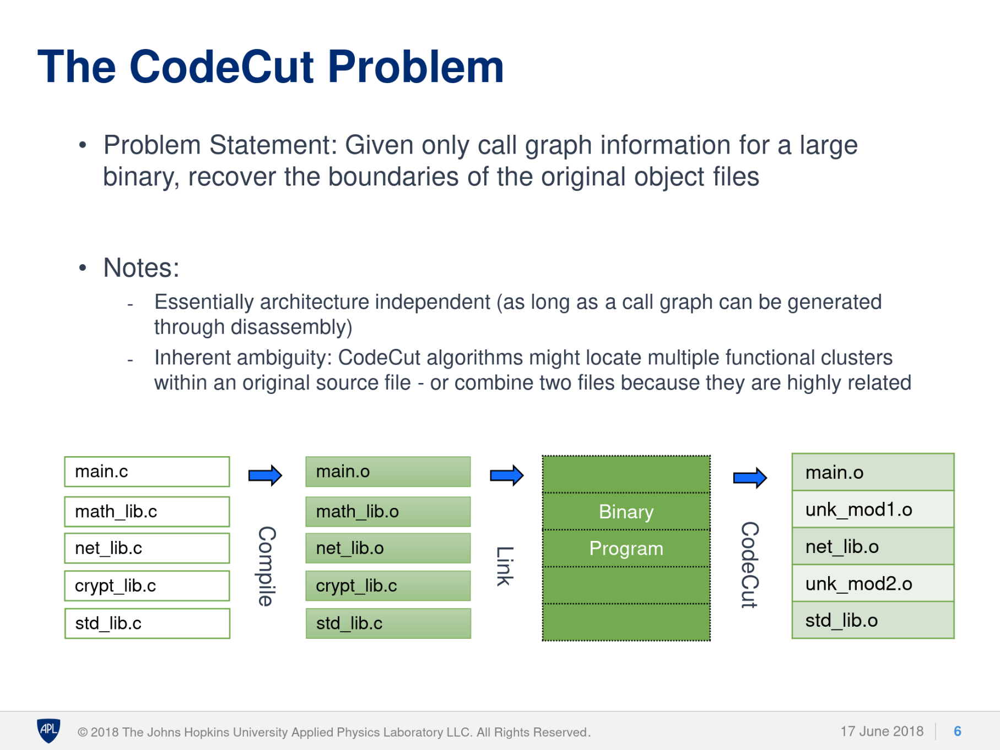
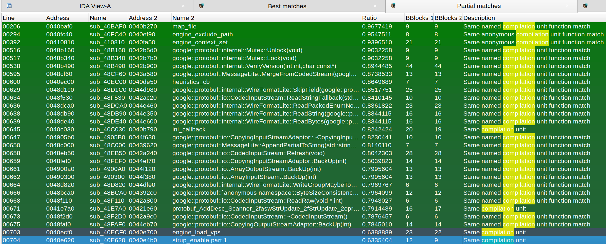

# Using compilation units for binary diffing

In this article I will try to explain how the concept of compilation units (one or
more source files which are compiled into one object file and is treated as a
single logical unit by a compiler) helps when doing binary diffing due to how
compilers and linkers, in general, work.

Heuristics using compilation units have been integrated into Diaphora 3.0.

## Finding compilation units

Long ago, before the pandemic, "I" had the idea of filtering functions when comparing
two binaries by using the compilation units (the source files) functions, so I
could, perhaps, brute force by doing `FirstSetRows X SecondSetRows` but instead
of doing it for the whole binary I could do it per compilation unit, reducing the
number of rows to be processed, minimizing the risk of false positives because
two functions that have the same body appear in different parts of the binary (this
is something more common than what you might think), etc... There was a "little"
problem: finding the compilation units boundaries in binaries with no debugging
information. But fortunately that was a problem were some people already worked
before, like [@evm_sec](https://twitter.com/evm_sec), who has been researching
and writing algorithms for this problem for quite [some](https://github.com/JHUAPL/CodeCut/blob/master/Old_IDA_version/evm-CodePiratesCutlass-RECON2018.pdf) [years](https://github.com/JHUAPL/CodeCut/blob/master/Old_IDA_version/evm-CodePiratesCutlass-Shmoocon2019.pdf). Basically, what
EVM does with the different versions of CodeCut that he wrote is to try to
find the boundaries of object files (the compilation units) inside binaries with no
debugging information, which is actually what I wanted to do in Diaphora. CodeCut's
author uses some methods, like Local Function Affinity (LFA) back in the day, or
neural networks as of today, to try to find the boundaries of the compilation units,
as shown in the following slide from a presentation done in RECON in 2018:

The results of such methods are varying but, over all, they tend to group functions
from the same compilation units even when the exact compilation units boundaries
aren't properly found. For example, a real source file like, `example.c`, can be
break up in 3 different anonymous compilation units by LFA. However, these 3
groups of functions are actually groups of related functions and chances are that
using LFA in another binary using this same compilation unit we would get the exact
same boundaries corresponding to these functions in that other binary, as the
algorithm is naturally deterministic.

## Named and anonymous compilation units

CodeCut, as far as I know, doesn't really mind about getting compilation unit names
(ie, `file.c` or `main.obj`), however, there is another IDA plugin of mine I wrote
some time ago that tries to do so: [IDA Magic Strings](https://github.com/joxeankoret/idamagicstrings).
Part of the functionality that this plugin offers is focused on trying to get
source files from debugging strings and, sometimes, if such information is actually
available, it can find functions that belong to this or that compilation unit. So,
why not use both tools functionality, CodeCut and IDA Magic Strings, to try to find
compilation units and assign a name to them? Well, this is what Diaphora 3.0 does
at export time now.

## Coalescing anonymous compilation units

As soon as I started implementing it I realized about something cool: when mixing
the information from both tools, I can get a more realistic view of the boundaries
of some compilation units. Why? Let's suppose the following hypothetical binary and
their respective compilation unit boundaries and source file names found by CodeCut
and IDA Magic Strings:

| Function      | CodeCut       | IDA Magic Strings  |
| ------------- | ------------- | ------------------ |
| FuncA         | compunit0     | main.c |
| FuncB         | compunit0     | NULL |
| FuncC         | compunit0     | NULL |
| ...|...|...|
| FuncG         | compunit1     | main.c |
| FuncH         | compunit2     | NULL |
| FuncI         | compunit2     | main.c |
| FuncJ         | compunit3     | NULL |
| ...|...|...|
| FuncX | compunitN | another.c |

As we can see, CodeCut would find some groups of functions, like `FuncA`, `FuncB`
and `FuncC` assigned to some anonymous compilation unit. IDA Magic strings found
some debugging strings referencing the source file (ie, the compilation unit) `main.c`
and thinks that `FuncA`, `FuncG` and `FuncI` might belong to this compilation unit.
In this case, as we know that linkers, in general, take object files corresponding
to compilation units and put the functions and objects in order in the binary (over all),
we can conclude that all functions starting from `FuncA` and ending with `FuncI` (at least)
belong to the same compilation unit and that this compilation unit's name is `main.c`.
Maybe `FuncJ` also belongs to `main.c`, but neither IDA Magic Strings nor CodeCut
found any evidence of this function belonging to the mentioned compilation unit,
so we consider it belongs to another compilation unit, in this hypothetical example,
to `compunit3`. There are many cases where debugging strings are not available
and Diaphora relies solely on what CodeCut's old LFA algorithm finds, but it's
stil a way to narrow down the number of functions in a binary to smaller sets
that can be used for finding matches.

## Heuristics using compilation units

Right now (Diaphora 3.0, in development, March 2023), there are 3 compilation units
based heuristics implemented in Diaphora:

1. Same named compilation unit function match. Two functions have the same assigned compilation unit and (fuzzily matched) Abstract Syntax Tree (AST).
2. Same anonymous compilation unit function match. Two functions have the same unnamed compilation unit and AST.
3. Same compilation unit. Two functions belonging to the same named or unnamed compilation unit have a good enough score.

As it's common when developing heuristics, they find many functions that were already
found by one of the so many other heuristics that Diaphora makes uses of, but there
are some results in multiple binaries of the testing suite that show it's working
well and finding new results, as the new picture shows:

## Ending

There are some more algorithms I have on mind to exploit this information (like
call graph matching using compilation units) but it's enough for now. I hope you
find this little article about compilation units matching in Diaphora interesting
and helpful. Thanks for reading, bye!

